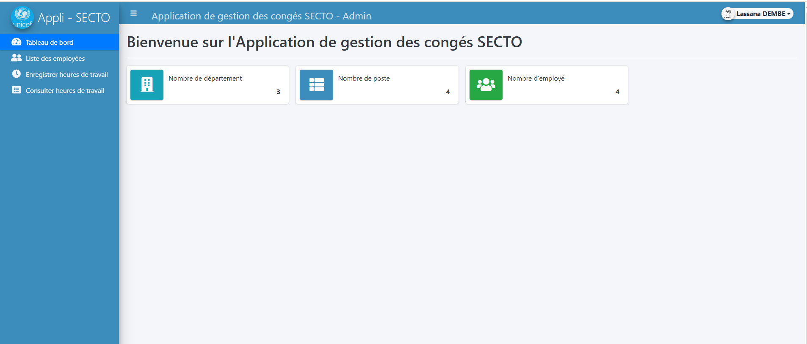
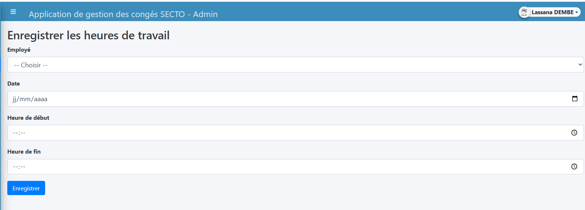

<p align="center">
    <a href="https://github.com/lassana99" target="_blank">
        
    </a>
</p>

<h1 align="center">conge_secto : Système Intégré de Gestion des Congés & RH</h1>

<p align="center">
    <strong>Digitalisation et automatisation des processus de gestion des absences pour SECTO.</strong><br>
    <em>Une solution performante en PHP Natif pour un suivi rigoureux du capital humain.</em>
</p>

---

## 📸 Aperçu de la Solution

### 🔐 Authentification & Sécurité
L'accès à la plateforme est sécurisé par un portail d'authentification dédié, garantissant la confidentialité des données personnelles et administratives.
<p align="center">
  
</p>

### 📊 Tableau de Bord (Accueil)
Le Dashboard offre une vue d'ensemble immédiate aux administrateurs et gestionnaires RH : statistiques des absences, demandes en attente et état global des effectifs.
<p align="center">
  
</p>

### 📅 Planification & Calendrier
Le module de planification permet une visualisation claire des congés validés et à venir, facilitant l'organisation des équipes et évitant les conflits de planning.
<p align="center">
  
</p>

---

## 🚀 Fonctionnalités Clés

- **Gestion des Dossiers Employés** : Centralisation des informations contractuelles et personnelles.
- **Workflow de Demande de Congé** : Processus dématérialisé allant de la soumission par l'employé à la validation par la hiérarchie.
- **Calcul Automatisé des Soldes** : Décompte automatique des jours restants selon les types de congés (Annuels, Maladie, Exceptionnels).
- **Suivi de la Planification** : Calendrier interactif pour une gestion prévisionnelle des absences.
- **Reporting RH** : Génération de rapports pour le suivi administratif et la paie.

## 🛠️ Stack Technique

- **Backend** : PHP 8.2 (Architecture Native)
- **Base de Données** : MySQL (Modèle Relationnel)
- **Frontend** : HTML5, CSS3 (Bootstrap 5), JavaScript
- **Design** : Responsive (Optimisé pour tous les écrans)
- **Serveur** : Compatible XAMPP / WAMP / Apache

## ⚙️ Installation & Configuration

1. **Clonage du projet** :
   ```bash
   git clone https://github.com/lassana99/application_de_gestion_des_conges.git